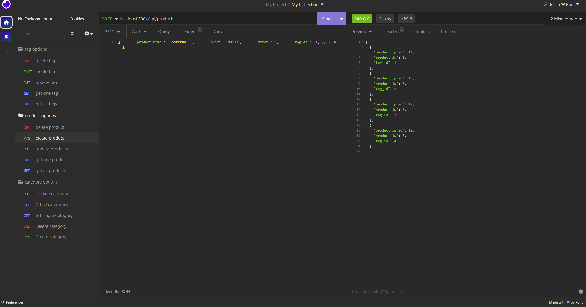

# ecommerce-website

## Description
Build a Note Taker so i can add and delete notes to stay ontrack 
this was my first time using heroku

## 📝 Table of Contents
- <a href="#description">Description</a>
- <a href="#installation">Installation</a>
- <a href="#usage">Usage</a>
- <a href="#contributors">Contributors</a>
- <a href="#license">License</a>
- <a href="#questions">Questions</a>
- <a href="#tests">Tests</a>

## Usage
Type in and keep track of employees and salerys keep track of there roles add and delete roles 

## Installation
install I
node index.js to start
mysql -u  ---  -p
npm i db/scheema.sql
You need insomnia

https://drive.google.com/file/d/19MbNuA_JXTzqJXNeR2tVvRpWIqGaglEu/view

## Contributors
Justin 

## Tests
NONE

## Questions
GITHUB: https://github.com/Activator95/

Contact Justinsemail12@yahoo.com

## License
This project is under MIT license
